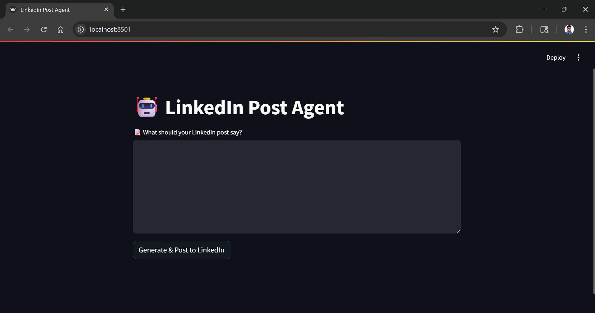
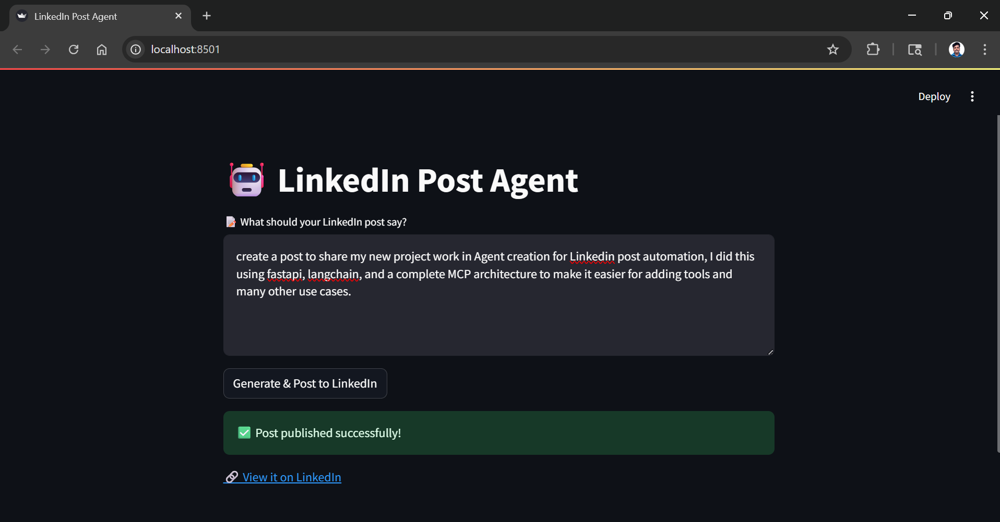

# Linkedin Post Agent

This project is a powerful and modular AI agent system that generates and posts professional LinkedIn content using OpenAI and LangChain, built with a clean **MCP** architecture.
It takes an input idea from the user, transforms it into a high-quality LinkedIn post using a custom prompt template, and posts it directly to the user's LinkedIn profile using LinkedIn’s API.

## 🚀 Features

- ✨ Human-style LinkedIn post generation with strict tone and structure guidelines
- 🧠 LangChain agent powered by OpenAI LLM (`gpt-4o`)
- 🧩 Modular MCP design: scalable and extendable with additional tools (e.g., X, Instagram)
- 🔧 Built-in LinkedIn posting tool via LinkedIn REST API
- 🖥️ Streamlit frontend for clean user interaction
- 🔄 FastAPI backend for MCP logic orchestration

## 📦 Tech Stack

- **Python** — Core backend language
- **Streamlit** — Web application framework for UI
- **FastAPI** — Backend API layer for handling requests and MCP orchestration
- **OpenAI GPT-4o** — LLM used for generating high-quality, human-style LinkedIn posts
- **LangChain** — Agent framework for chaining prompt execution and tool usage
- **LinkedIn REST API** — Used to post directly to LinkedIn profiles

## 📁 Project Structure

```
/project-root/
├── streamlit_app/
│   └── app.py
├── mcp_server/ 
│   ├── main.py 
│   ├── agent_runner.py 
│   ├── llm/
│   │   └── llm_config.py 
│   ├── agents/
│   │   └── post_writer_agent.py 
│   └── tools/
│       └── linkedin_poster.py 
├── .env 
├── requirements.txt 
└── README.md
```

## 📸 Screenshots




## Author

👤 **[Vetrivel Maheswaran](https://github.com/Vetrivel07)**

## Connect With Me 🌐

**[](https://www.linkedin.com/in/vetrivel-maheswaran/)**

**[](https://vetrivel07.github.io/vetrivel-maheswaran)**

<p align="center"><b>© Created by Vetrivel Maheswaran</b></p?
